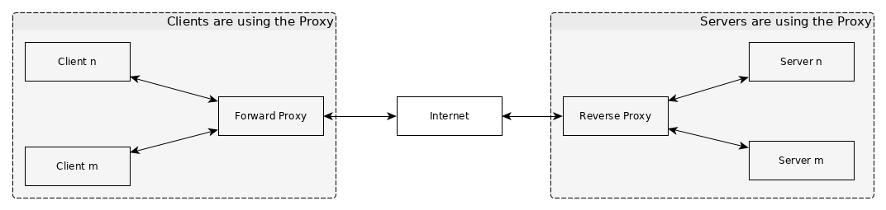

# Content
* [network](#network)
* [virtualbox](#virtualbox)
* [cryptography](#cryptography)
* [h2 database](#h2-database)
* [cheatsheet: linux](#cheatsheet:-linux)
* [cheatsheet: windows](#cheatsheet:-windows)
* [testing](#testing)

# cheatsheet: intellij / android studio

```
SHIFT + F6  // rename
CTRL + SHIFT + R    // find and replace
SHIFT + F10 // run
F10 (file > settings > keymap > set a key for distraction) // Distraction-Free Mode; View > Distraction-Free Mode
CTRL + F4   // close tab
CTRL + 7    // un/comment; file > settings > keymap
CTRL + ALT + O	// organize imports
CTRL + ALT + L	// format code
CTRL + B    // jump to source
CTRL + O    // override methods
2x SHIFT    // global search (commands, open files, ...)
CTRL + E    // open recently opend files
CTRL + ALT + M  // extract function
CTRL + I    // implement methods
CTRL + ALT + INSERT / EINFG // create new file
ALT + 1 // open / close project view
ALT + 4 // open / close run view
SHIFT + ALT + left/right    // switch design / text tab in layout

CTRL + ALT + L  // reformat code (Android Studio)
```

# network

## Proxy
* there are two types of a proxy (server)
* __forward__ proxy: the client is using the proxy
* __reverse__ proxy: the server is using the proxy



_drawn with yed_

__Why use a proxy?__
* a proxy acts as a middleman. in other words: the traffic goes through the proxy
* protect client or server from direct interactions (=security)

## Load Balancer
* __distributes__ the total load / traffic to multiple servers


# virtualbox
```
vboxmanage list vms
"WinDev1910Eval" {...}
```

# cheatsheet: linux

* unpack compressed tar gz files
```
tar xfv ../Downloads/zulu8.40.0.25-ca-jdk8.0.222-linux_x64.tar.gz
unzip netbeans.zip
unzip -l netbeans.zip	// list files
unzip netbeans.zip -d specific-dir/		// extract to dir specific dir
zip -r -0 -s 900m archive-0.zip folder-to-archive/    // split zip each 900MB; just archive no compress; recursivly.
```

* copy, disc usage / free
```
cp -v folder/file-* .   // copy all files with file-* to current folder. verbose on.
for i in {1..100}; do cp free.ogg "free$i.ogg"; done    // copy files multible times
df -h . // free disk space; human readable
du -h --max-depth=1 /home/  // disc usage for a folder with given depth
```

* network / openwrt
```
arp	// list MAC adress to IP adress
cat /var/dhcp.leases	// show IP adress, hostname, MAC adress
nmap -v ip.adress	// fast simple scan for default ports
sudo service dnsmasq restart	// restart dnsmasq: DCHP server (usually this is installed on openwrt)
dmesg	// display kernel ring buffer (data structure of messages operated by kernel)
```

* symbolic links
```
ln -s apache-maven-3.6.1 maven
ln -s zulu8.40.0.25-ca-jdk8.0.222-linux_x64 jdk
rm jdk  // remove symbolic link
```

* image resize
```
# dependency: imagemagick
convert -resize 25% screenshot.png screenshot.png
```

* config the environment variable PATH. Put that in ~/.profile (restart)

__user management__
* create user: `useradd guest`
* check user account information _passwd_: `cat /etc/passwd | grep guest`
```
guest:x:1001:1001::/home/guest:/bin/sh 

[username]:[x]:[UID]:[GID]:[Comment]:[Home directory]:[Default shell]
```
* check group account information _group_: `cat /etc/group | grep guest`
```
guest:x:1001:

[Group name]:[Group password]:[GID]:[Group members]
```
* modify user: `usermod --expiredate 2020-01-01 guest`

* set password: `passwd guest`

* delete user: `userdel --remove guest`. will also delete `/var/mail/guest` and `/home/guest`

__group management__
* display, add, delete group
* add user to group
```
$ groups guest
guest : guest

$ groupadd restricted	# will take the next free gid usually 1001 
$ groupadd -g 2000 restricted	# we specify the gid (= 2000)

$ cat /etc/group | grep restricted
restricted:x:2000:

$ chown guest:restricted open.txt 

$ ls -l open.txt 
-rw-r--r-- 1 guest restricted 15 Dez 23 23:50 open.txt

$ usermod -aG restricted guest

$ groups guest
guest : guest restricted

$ chmod 440 open.txt

$ ls -l open.txt 
-r--r----- 1 guest restricted 18 Dez 24 00:37 open.txt

$ groupdel restricted
```

## jdk, maven, netbeans, ...

```
PATH="$HOME/development/jdk/bin:$PATH"
PATH="$HOME/development/maven/bin:$PATH"
PATH="$HOME/development/netbeans/bin:$PATH"
```

## general

__image resize__
```
# imagemagic must installed
convert -resize 70% sketch.png sketch-.png
```

__iso to usb stick__

```
sudo dd if=linux.iso of=/dev/sda bs=1M && sync
```

__battery lifetime / runtime with TLP__

```
sudo tlp-stat -s	// manual start
sudo tlp-stat -b	// show battery info

/sys/class/power_supply/BAT0/cycle_count                    =      3
/sys/class/power_supply/BAT0/energy_full_design             =  57020 [mWh]
/sys/class/power_supply/BAT0/energy_full                    =  57660 [mWh]
/sys/class/power_supply/BAT0/energy_now                     =  47530 [mWh]
/sys/class/power_supply/BAT0/power_now                      =   7446 [mW]
/sys/class/power_supply/BAT0/status                         = Discharging
Charge                                                      =   82.4 [%]
Capacity                                                    =  101.1 [%]
```

__show / change display brightness / backlight__
```
cat /sys/class/backlight/amdgpu_bl0/brightness
```

__file operation__
```
curl https://archive.ics.uci.edu/ml/machine-learning-databases/iris/iris.data --output iris.data

split -l 50 file.csv  // split file to multiple files for given line number

grep -n 'search' file.csv // line numbers occurence

sed -n '/pattern/=' file.csv  // line numbers occurence
```

## ubuntu
* shortcuts
```
ALT + SHIFT + T		// open terminal
CTRL + SHIFT + T	// terminal: open tab
```

* update, upgrade, install software
```
sudo apt update
sudo apt upgrade
sudo apt install git
```

# cryptography
* encryption / ciphering / encoding
* we need encryption when ever we send information over unsafe networks.
* main target of cryptography
    * Confidentiality: only authorized person can read protected information
    * Authentication: you talk to the right person. you can trust.
    * Integrity: the message hasnt been changed
* encrypt a plaintext with a key and algorithm: `plaintext -> chiphertext`

## hashing
* a one-way function / fingerprint
* used e.g. for passwords. the hash of it is stored then stored.

_example: python MD5_
```
>>> hashlib.md5(b'bob').hexdigest()
'9f9d51bc70ef21ca5c14f307980a29d8'
>>> hashlib.md5(b'bob').hexdigest()
'9f9d51bc70ef21ca5c14f307980a29d8'
```

## symmetric / asymmetric encryption
* symmetric encryption (algorithms): only _one key_ for encryption and decryption
    * problem: both user has to know the key
* asymmetric encryption / _public key cryptography_ : key pair (private key and public key)
    * the information can decrypted with private key
    * encryption with public key

## certificates: encrypted connections
For an secure connection between two nodes (e.g. client / server) we can use TLS (SSL). In order to accomblish this we need a few artifacts.

First of all we need a _SSL certificate_.

__Signed certificate__: In order to obtain a _signed_ SSL certificate we can create a private key and a _CSR_ with _OpenSSL_.

With the _key_ file we create the CSR. And with the CSR in turn we can request a signed digital certificate from an _CA_.

For the key generation you can use a common public-key cryptosystem provided in OpenSSL.


__Self-signed certificate__ is the counterpart of the CA signed certificate.

Here you just create your private key and your certificate. And use it for secure connection.

## terminology
* private key file
* CSR: Certificate Signing Request
* CA: certificate authority

# cheatsheet: windows

```
rmdir /S    // delete folder
move source-folder .    // move folder to current folder
```

# h2 database 
* (embedded / payara)
* start database: ```asadmin start-database```
* stop database: ```asadmin stop-database```
* sql connect (e.g. payara5\h2db\bin): ```java -cp h2.jar org.h2.tools.Shell```
* create database (take default settings):
```
JDBC URL: jdbc:h2:~/test
Database/Schema: ~/test
```
* show tables
```
sql> show tables;
TABLE_NAME | TABLE_SCHEMA
DEVELOPER  | PUBLIC
```
* create table
```
CREATE TABLE PUBLIC.DEVELOPER (
	NAME VARCHAR(10),
	PROGRAMMING_LANGUAGE VARCHAR(10),
	CONSTRAINT DEVELOPER_PK PRIMARY KEY (ID)
);
```
* quit from sql shell: ```quit```

# testing
_source: ant in action_
* _Unit tests_ test a piece of a program, such as a class, a module, or a single method.
They can identify problems in a small part of the application, and often you can
run them without deploying the application.
* _System tests_ verify that a system as a whole works. A server-side application
would be deployed first; the tests would be run against that deployed system,
and may simulate client behavior. Another term for this is functional testing.
* _Acceptance tests_ verify that the entire system/application meets the customers’
acceptance criteria. Performance, memory consumption, and other criteria may
be included above the simple “does it work” assessment. These are also some-
times called functional tests, just to cause extra confusion.
* _Regression testing_ means testing a program to see that a change has not broken
