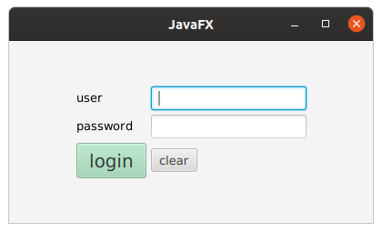

# JavaFX hands-on

* create a default maven project
* add _plugin_ and _dependency_: https://openjfx.io/openjfx-docs/#maven
* build and run: `mvn clean javafx:run`



## cheatsheet
* Stage: represent a window and is created by JavaFX runtime
* Scene: represent the content display inside a window


## run in netbeans
* if you use netbeans you can activate javafx implementation for linux
* or just add an `nbaction.xml` in your project root
```
<?xml version="1.0" encoding="UTF-8"?>
<actions>
    <action>
        <actionName>run</actionName>
        <packagings>
            <packaging>jar</packaging>
        </packagings>
        <goals>
            <goal>clean</goal>
            <goal>javafx:run</goal>
        </goals>
    </action>
</actions>
```

